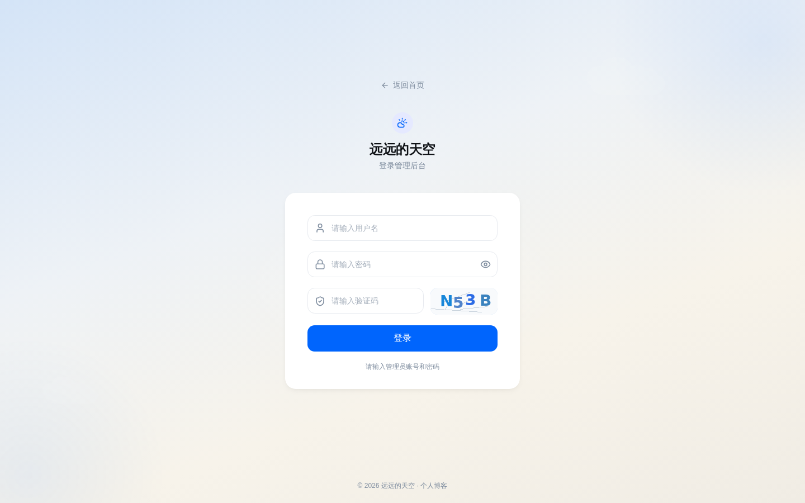
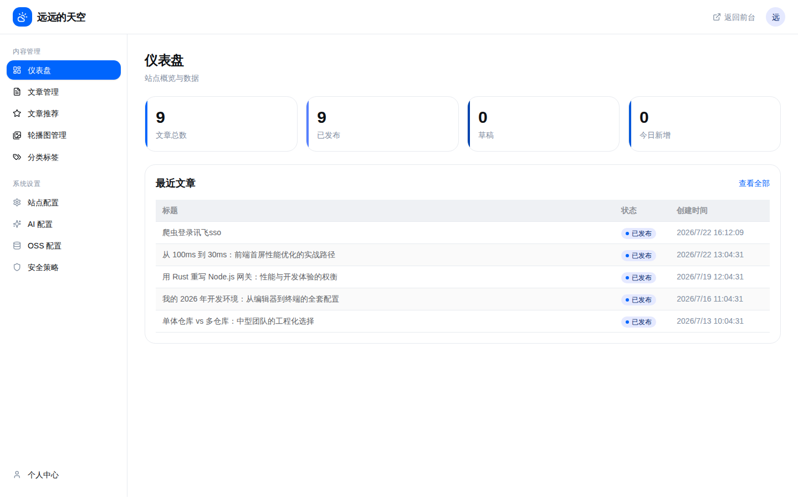
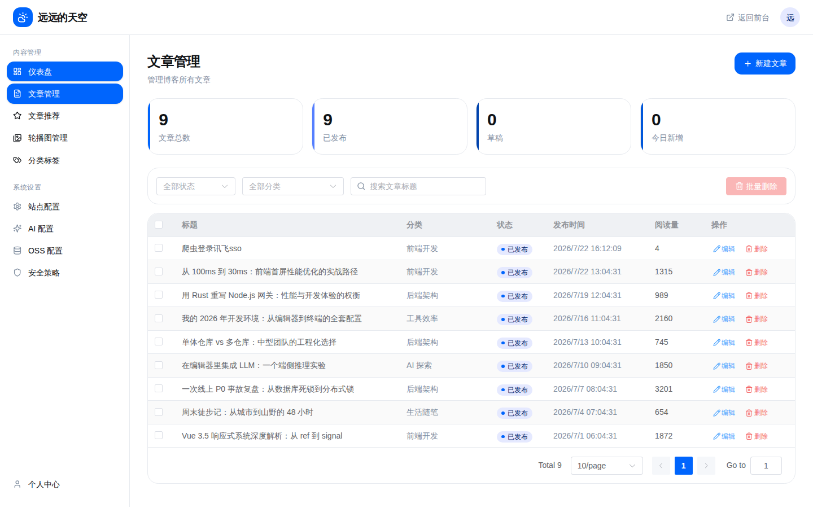
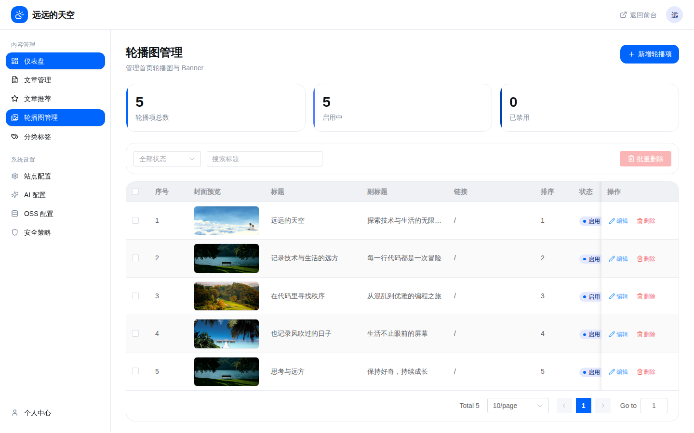
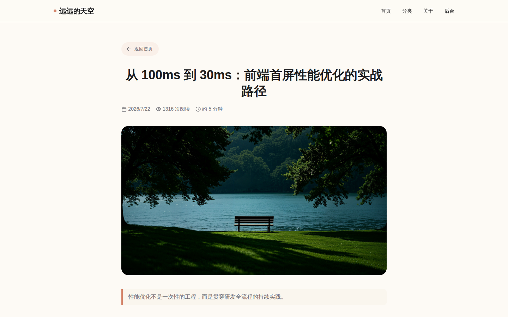

# 远远的天空 — 个人博客系统

一个基于 **Vue 3 + Flask** 的全功能个人博客系统，支持文章管理、轮播图管理、分类标签、文章推荐等功能。

> **GitHub**: [github.com/jingzty/yuanyuan_blog](https://github.com/jingzty/yuanyuan_blog)

---

## 📸 系统截图

| 页面 | 预览 |
|------|------|
| **首页** — Hero 轮播 + 文章列表 + 侧边栏 |  |
| **登录页** — 渐变背景 + 验证码登录 |  |
| **后台仪表盘** — 统计卡片 + 后台布局 |  |
| **文章管理** — 表格 + 筛选 + 分页 |  |
| **轮播图管理** — 图片预览 + 排序 + 状态 |  |
| **文章详情** — Markdown 渲染 + 上下篇 |  |

---

## ✨ 功能特性

### 前台功能
- **Hero 轮播** — 3 张幻灯片，自动播放（5000ms 间隔），悬停暂停，左右切换 + 圆点指示器
- **文章列表** — 展示最新 5 篇文章，包含封面、摘要、分类、标签、阅读量
- **文章详情** — Markdown 渲染，上下篇导航，进入自动计数阅读量
- **侧边栏** — 全文搜索、热门标签云、分类列表、关于博主
- **响应式布局** — 适配移动端到桌面端

### 后台管理
- **仪表盘** — 统计数据概览
- **文章管理** — CRUD 操作，Markdown 编辑器，草稿/发布状态
- **轮播图管理** — 添加/编辑/排序/启用禁用
- **文章推荐** — 精选文章管理
- **分类管理** — 创建/编辑/删除
- **JWT 认证** — 登录/登出，验证码保护

---

## 🏗 技术栈

| 层级 | 技术 |
|------|------|
| **前端框架** | Vue 3 (Composition API) + Vite 6 |
| **UI 组件** | Element Plus（后台）、Lucide 图标 |
| **样式** | Tailwind CSS v4 |
| **状态管理** | Pinia |
| **路由** | Vue Router 4 |
| **后端** | Flask 3 + Flask-SQLAlchemy |
| **认证** | Flask-JWT-Extended + 验证码（Pillow） |
| **数据库** | SQLite（开发） |
| **编辑器** | Markdown + 实时预览 |

---

## 📁 项目结构

```
test5/
├── backend/                    # 后端
│   ├── app/
│   │   ├── __init__.py         # Flask 应用工厂
│   │   ├── config.py           # 配置文件
│   │   ├── models.py           # 数据库模型
│   │   ├── api/
│   │   │   ├── auth.py         # 认证 API（登录/验证码/登出）
│   │   │   ├── article.py      # 文章 CRUD API
│   │   │   ├── banner.py       # 轮播图 CRUD API
│   │   │   ├── category.py     # 分类 API
│   │   │   └── featured.py     # 文章推荐 API
│   │   └── utils/
│   │       └── responses.py    # 统一响应格式
│   ├── run.py                  # 启动入口
│   ├── seed_data.py            # 种子数据脚本
│   ├── requirements.txt        # Python 依赖
│   └── venv/                   # Python 虚拟环境
│
├── frontend/                   # 前端
│   ├── src/
│   │   ├── main.js             # 应用入口
│   │   ├── App.vue             # 根组件
│   │   ├── router/index.js     # 路由配置（含登录守卫）
│   │   ├── stores/auth.js      # 认证状态（Pinia）
│   │   ├── api/                # API 请求层（axios）
│   │   │   ├── request.js
│   │   │   ├── auth.js
│   │   │   ├── article.js
│   │   │   ├── banner.js
│   │   │   ├── category.js
│   │   │   └── featured.js
│   │   ├── layouts/
│   │   │   ├── FrontLayout.vue  # 前台布局（导航+页脚）
│   │   │   └── AdminLayout.vue  # 后台布局（侧边栏+顶栏）
│   │   ├── views/
│   │   │   ├── HomeView.vue     # 首页（轮播+文章+侧边栏）
│   │   │   ├── LoginView.vue    # 登录页
│   │   │   ├── ArticleDetailView.vue  # 文章详情
│   │   │   ├── CategoryView.vue       # 分类文章
│   │   │   └── admin/
│   │   │       ├── DashboardView.vue      # 仪表盘
│   │   │       ├── ArticleManageView.vue  # 文章管理
│   │   │       ├── ArticleEditView.vue    # 新建/编辑文章
│   │   │       ├── BannerManageView.vue   # 轮播图管理
│   │   │       ├── CategoryManageView.vue # 分类管理
│   │   │       └── FeaturedManageView.vue # 文章推荐管理
│   │   └── components/
│   │       ├── ArticleCard.vue  # 文章卡片组件
│   │       └── StatCard.vue     # 统计卡片组件
│   ├── package.json
│   └── vite.config.js          # Vite 配置（代理 /api → :5000）
│
├── docs/                       # 设计文档
│   ├── 01-design-spec.md       # 设计规范（色彩/字体/间距/圆角）
│   └── 02-feature-list.md      # 功能点清单
│
└── pic/                        # 项目截图
    ├── 01-home.png
    ├── 02-login.png
    ├── 03-admin-dashboard.png
    ├── 04-admin-articles.png
    ├── 05-admin-banners.png
    └── 06-article-detail.png
```

---

## 🚀 快速开始

### 环境要求

- **Node.js** >= 18
- **Python** >= 3.10

### 1. 启动后端

```bash
cd backend
source venv/bin/activate        # 激活虚拟环境
pip install -r requirements.txt  # 安装依赖（首次）
python3 run.py                   # 启动（默认 :5000）
```

如需重新生成种子数据：

```bash
python3 seed_data.py
```

### 2. 启动前端

```bash
cd frontend
npm install     # 安装依赖（首次）
npm run dev     # 启动开发服务器（默认 :5173）
```

### 3. 访问系统

- **前台首页**: http://localhost:5173
- **后台管理**: http://localhost:5173/admin
- **登录**:
  - 默认账号: `admin`
  - 默认密码: `admin123`

> 前端开发服务器已配置代理，`/api` 请求自动转发到后端 `:5000`。

---

## 🎨 设计规范

项目设计稿来源于 `muban.zip`，详细设计规范见 [docs/01-design-spec.md](docs/01-design-spec.md)。

### 色彩

| 用途 | 色值 |
|------|------|
| 主色 | `#0065fd` |
| 主色淡 | `#e5e9ff` |
| 页面背景 | `#ffffff` |
| 主文字 | `#0e1115` |
| 边框 | `#e7eaef` |

### 排版

- **圆角**: 卡片 1.2rem / 按钮 0.8rem / 标签 0.4rem
- **字体**: PingFang SC / Microsoft YaHei / ui-sans-serif
- **阴影**: 柔和低对比风格

---

## 🗄 数据模型

| 模型 | 说明 | 主要字段 |
|------|------|----------|
| `User` | 用户（单博主） | username, password_hash |
| `Article` | 文章 | title, summary, content, cover_url, view_count, status |
| `Category` | 分类 | name, created_at |
| `Banner` | 轮播图 | title, subtitle, image_url, link_url, sort_order |
| `FeaturedArticle` | 推荐文章 | article_id, sort_order, status |

---

## 📋 API 路由

| 方法 | 路径 | 说明 |
|------|------|------|
| POST | `/api/v1/auth/login` | 登录 |
| GET | `/api/v1/auth/captcha` | 获取验证码 |
| GET | `/api/v1/auth/me` | 当前用户信息 |
| POST | `/api/v1/auth/logout` | 登出 |
| GET/POST/PUT/DELETE | `/api/v1/articles` | 文章 CRUD |
| GET/POST/PUT/DELETE | `/api/v1/banners` | 轮播图 CRUD |
| GET/POST/PUT/DELETE | `/api/v1/categories` | 分类 CRUD |
| GET/POST/PUT/DELETE | `/api/v1/featured` | 文章推荐 CRUD |

---

## 📝 许可

[MIT License](LICENSE)
